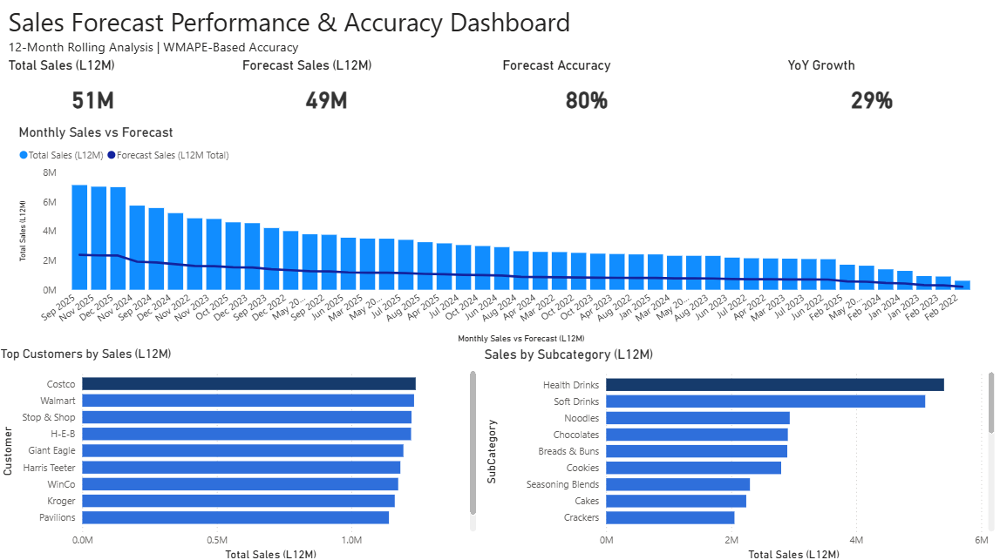
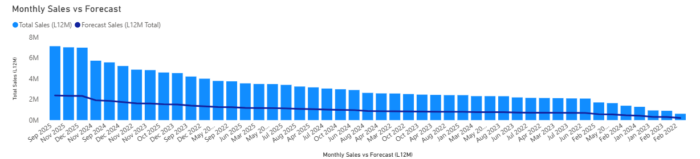
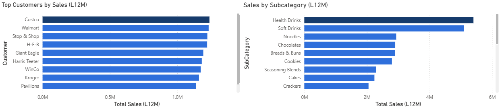

# Sales Forecast Performance & Accuracy Dashboard

## Overview
This project showcases a Power BI dashboard designed to monitor sales performance and forecast accuracy using a rolling 12-month view. The dashboard provides decision-ready visibility into forecast quality and sales trends across customers and product categories.

## Business Problem
Sales and forecast performance are often reviewed across different time horizons and dimensions, which can make consistent comparison over time difficult. This dashboard provides a standardized rolling 12-month view to support consistent performance monitoring and trend analysis.

## Key Metrics
-**Forecast Accuracy (WMAPE)**: Weighted Mean Absolute Percentage Error calculated over a rolling 12-month period
-**L12M Sales**: Total actual sales for the most recent 12 completed months 
-**YoY Growth**: Year-over-year change in rolling 12-month sales

## Dashboard Features
-Monthly actual vs forecast sales trends using a rolling 12-month window
-Forecast accuracy KPI summary
-Top customers by sales (L12M)
-Sales by product subcategory
-Interactive filtering by time and product attributes

## Data Model
The dashboard uses an analytics-style dimensional model with separate tables for calendar, sales, forecast, and descriptive attributes such as customer and product. Rolling 12-month metrics are dynamically calculated using time-intelligence logic anchored to the most recent available period.

## Tools Used
-Power BI
-Power Query (M) for data transformation
-Excel-based source data

## Notes
In a production environment, this dashboard would be powered by a centralized data warehouse with scheduled refreshes and shared metric definitions to ensure consistency across use cases.

## Screenshots

